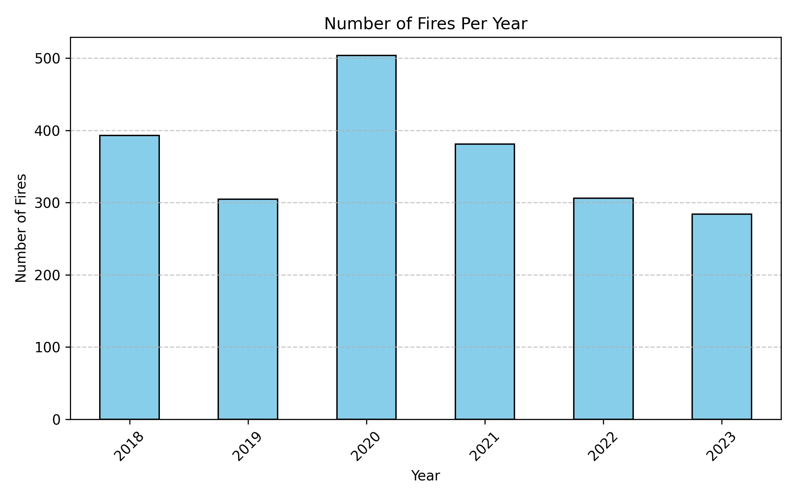
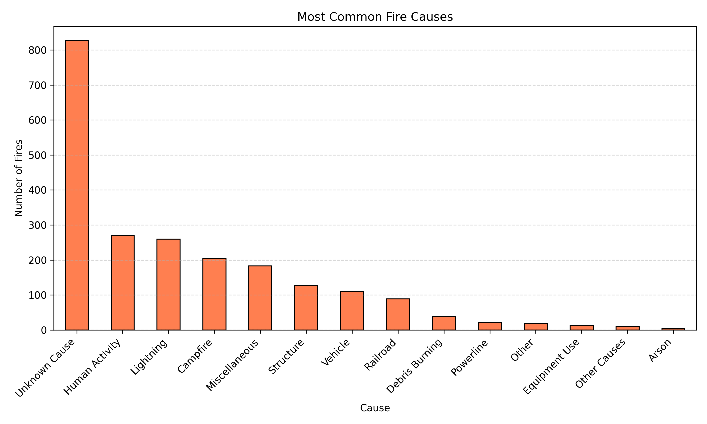
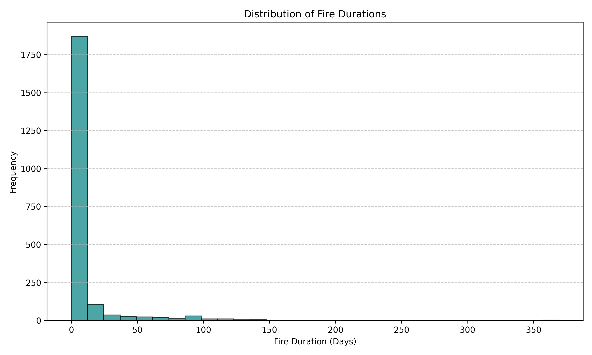
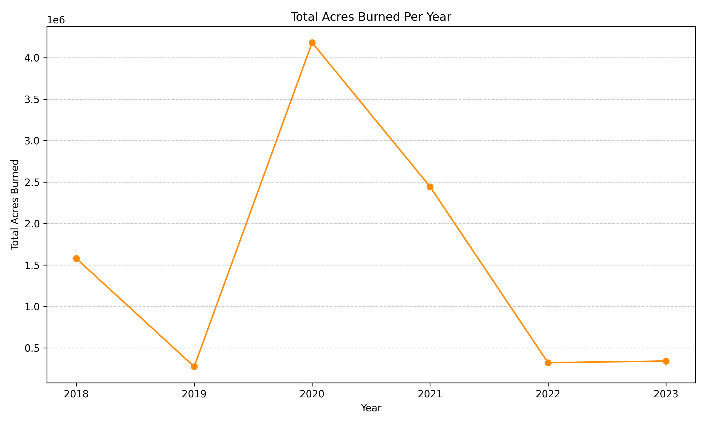
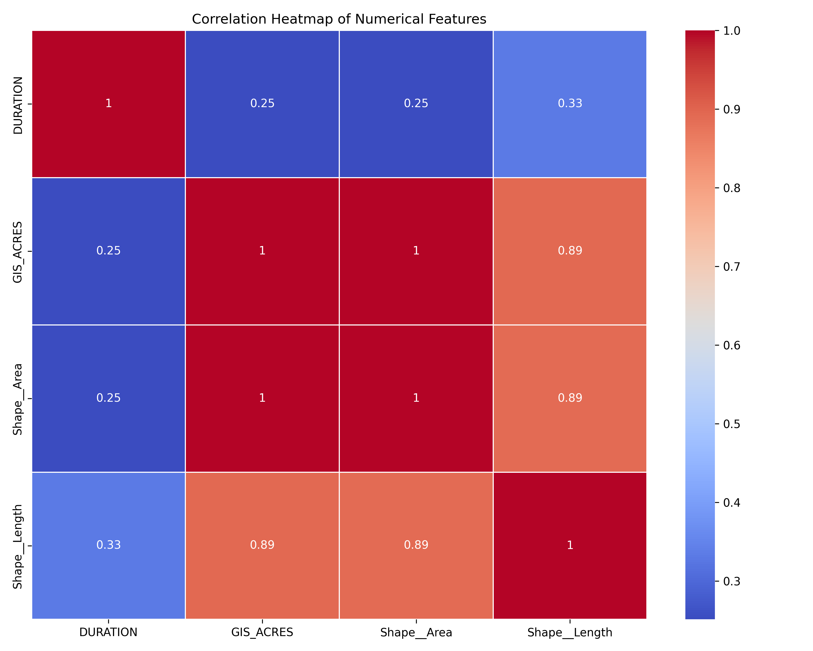

# California Fire Analysis Project

## Overview
This project analyzes California fire incidents using data from 2018 to 2023. The objective is to uncover patterns and trends in fire occurrences, causes, and severity, and to create visualizations that provide meaningful insights.

## Goals
- Analyze the number of fires per year.
- Explore the most common fire causes.
- Investigate fire durations and severity.
- Visualize trends in acres burned over time.
- Identify correlations between key variables.

## Tools and Libraries Used
- **Python**: Data cleaning and analysis.
- **Pandas**: Data manipulation.
- **Matplotlib & Seaborn**: Data visualization.
- **GitHub**: Version control and project hosting.

## Visualizations
1. **Number of Fires Per Year**:
   

2. **Most Common Fire Causes**:
   

3. **Distribution of Fire Durations**:
   

4. **Acres Burned Over Time**:
   

5. **Correlation Heatmap**:
   

## Insights
- The highest number of fires occurred in 2020.
- "Unknown Cause" and "Human Activity" are the most frequent fire causes.
- Most fires last less than 10 days.
- Fire severity (acres burned) peaked significantly in 2020.
- `GIS_ACRES` and `Shape__Length` show strong correlations.

## How to Run the Project
1. Clone this repository:
   ```bash
   git clone <https://github.com/Kiranj27/california-fire-analysis.git>
   cd california-fire-analysis
